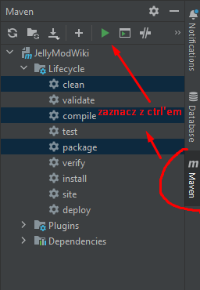

# Getting Started

## How to run app?

Using a terminal, run the 
"docker compose up -d"
command to create a docker container with a postgresql database. 
To execute this command you need to have the docker desktop application running
After creating the docker container, start the application in intellij. Sometimes you may need to use clean, compile and package (as we use the automatically generated MapStruct mappers)

### Documentation and testing - REST API

## OpenApi

### What is OpenApi?
Automatically generated documentation - OpenApi. https://swagger.io/

### Description
Once the application and database are up and running, you can follow the link: 
http://localhost:8080/swagger-ui/index.html#/ 
which allows you to read the documentation and test the endpoints of the application.
It presents models of the data returned, examples of the data returned and allows queries to be executed.

## Technologies used in the application

### PostgreSQL
Database

### FlyWay
Flyway is a tool that enables database versioning.
https://flywaydb.org/

### Hibernate
framework for implementing the data access layer (database things)

### Docker
Currently we only use docker-compose which allows us to set up a database 

### MapStruct
Code generator to get rid of boiler-plate code. Thanks to it, we do not have to write entire mappers for DTO<->Entity classes. We just need to write what the method accepts and returns and the mapper generates the code itself.
https://mapstruct.org/

### OpenApi
Generate documentation & Test API

### Lombok
Your most favourite thing in the world. Don't write more getters, setters, constructors, builders and other crap. Lombok will generate everything for you if you just give it the right annotations over the classes:)
@Getter
@Setter
@Builder

## Things worth knowing

* what is CRUD?
* what is RestAPI?
* SOLID?
* Spring components: @Repository @Service @Controller @Bean

